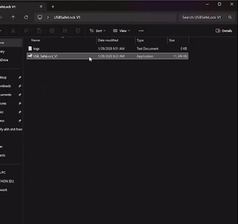

# USB-Safe-Lock-V1
A reverse Windows login for USBs

## Outline
The USB Safe Lock is a .exe program that once used, will detect a USB that is plugged into the computer. Once the user has selected a USB to use, it will write a encrypt file and will automaticly lock out the user if the USB contents are altered, missing, or changed. Developed by Soluner.
### Detections
The program detects 6 diffrent methods for locking the user out of the computer.
- The USB mount point is changed or missing
- The USB is Unplugged
- The contents of the USB code file created does not match the encrypted code stored in the RAM
- The Total Size of the USB is Diffrent
- The File Type (Fat32, NVME, ect.) is Changed
- Any other error occures within the code or process of getting the USB data

## Known Issues
- There is not a current way to safely exit the program from the lock screen other than restarting the System
